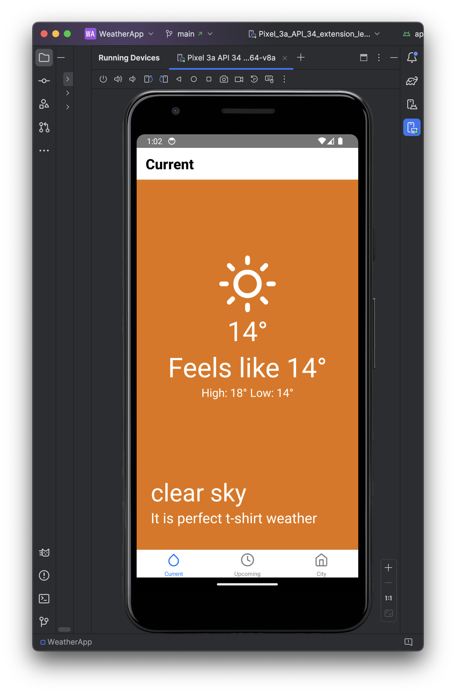
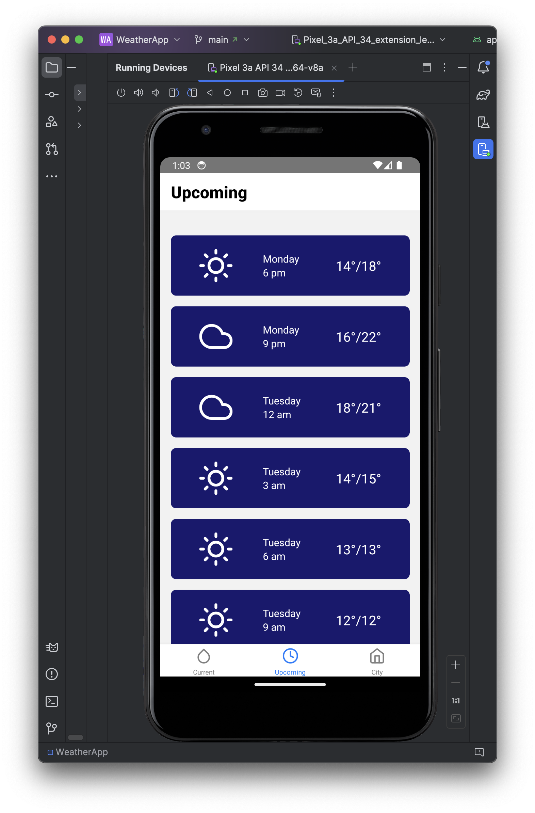
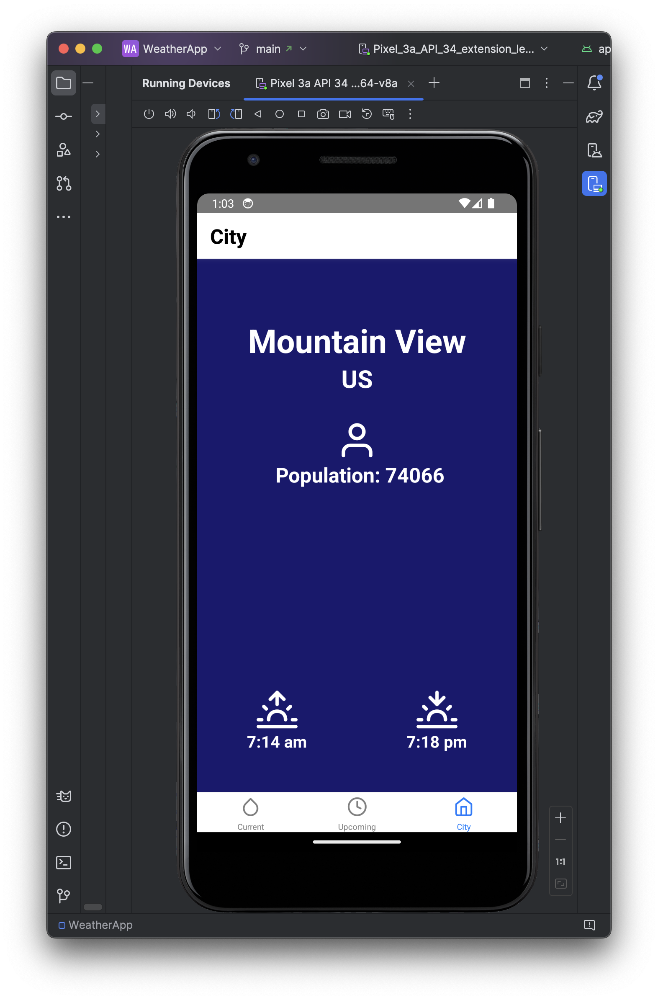

# WeatherApp

This is a React Native app displaying current weather, upcoming weather and city information based on the device location. It relies on the OpenWeather API to get weather data.

The app has been tested on Android.

## Techniques implemented

- Fetching API data
- Navigation between different screens using tabs
- Handling of time zones (UTC and local time)
- Testing with Jest and React Testing Library

## Screenshots

| Current Weather Screen | Upcoming Weather Screen | City Screen |
|---|---|---|
|  |  |  |